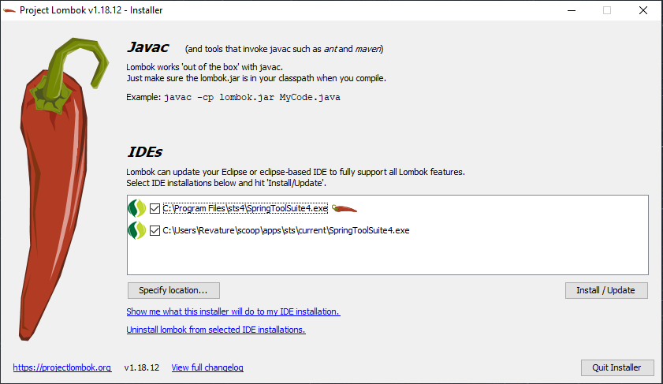
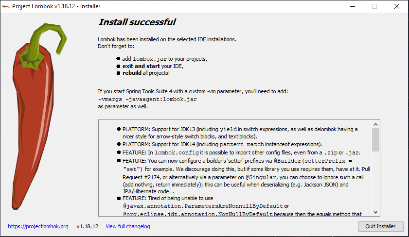

# Building a Microservice Application

## Purpose

This tutorial will cover converting a basic monolithic Spring Boot application into a microservices application. It will then address common issues faced by microservice applications by leveraging the [Spring Cloud Netflix Stack](https://spring.io/projects/spring-cloud-netflix). The monolithic version of the application will be provided as a starting point. This example will span multiple phases, which can be found in the corresponding folders.

### Getting Started: Prerequisites

* Obtain the starting application by cloning this repository
```bash
git clone https://gitlab.com/revature_training/microservices-team.git
```
The starting project is located at `microservices-team/microservices-standard-examples/example0/initial/`

* You will need to have an IDE, we recommend [Spring Tool Suite](https://spring.io/tools)

* You will need [Java 8](https://www.oracle.com/java/technologies/javase/javase-jdk8-downloads.html) installed

* OPTIONAL: For ease of developing model classes, we use [Lombok](https://projectlombok.org/download)

Note: All Lombok annotations can be replaced with auto-generated code snippets

The downloaded executable must be applied to the IDE in use, just direct it to the Spring Tool Suite installation directory, and can be applied to multiple IDEs at once, such as shown below.



Then make sure to restart the IDE for Lombok to be successfully applied.

## Phase 1: Separate Monolith by Domain

We will start off by separating the application into multiple smaller services that are each responsible for one area of the application.

In our case, we will have 2 services for the quiz and flashcard services.

The details can be found in [Phase 1](./phase1).

## Phase 2: Manage our Services

Now that we have our services communicating, we notice that there is a potential issue as we expand our application. We would have to keep track of the location of every service in order for our RestTemplate to communicate with. This is not sustainable, especially if our goal is to use horizontal scaling, where the location of our services will be changing dynamically.

So we resolve this by levering Service Discovery with [Netflix Eureka](https://spring.io/guides/gs/service-registration-and-discovery/) and an API Gateway with [Netflix Zuul](https://spring.io/guides/gs/routing-and-filtering/).

The details can be found in [Phase 2](./phase2).

## Phase 3: Circuit-Breaking

We are now leveraging Service Discovery and API Gateway to facilitate ease of development from now on. At this point, each team that is responsible for a single microservice are able to continue to implement useful features. From here on, this demonstration will focus on stabilizing the application to fail gracefully in the event of some services not being available.

We'll accomplish this by Circuit-Breaking with [Netflix Hystrix](https://spring.io/guides/gs/circuit-breaker/) and [OpenFeign](https://spring.io/projects/spring-cloud-openfeign).

The details can be found in [Phase 3](./phase3).

## Phase 4: Centralized Configuration

Our application is now performing well for future development and higher scale. The next bottleneck that we are starting to notice however is the mess of configuration files that the application has across the many services.

Centralized Configuration can be accomplished with [Spring Cloud Config](https://spring.io/guides/gs/centralized-configuration/).

The details can be found in [Phase 4](./phase4).

## Phase 5: Eventual Consistency

The last feature we'd like to add to our Microservice application is Eventual Consistency in order to have very efficient scaling as we service more and more requests at a time. Instead of purchasing a more powerful server simply to send the same data in response, we'll choose to perform data replication with eventual consistency. This way we can horizontally scale our databases as well as our services.

We'll achieve Eventual Consistency with [Apache Kafka](https://kafka.apache.org/intro).

The details can be found in [Phase 5](./phase5).
