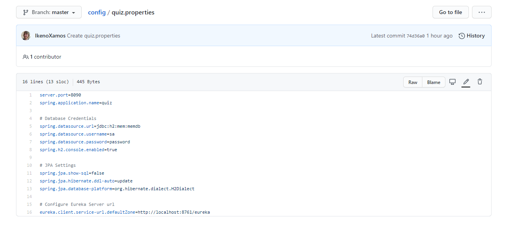

# Phase 4: Centralized Configuration

In this phase we will address the growing problem of distributed configuration. We are seeeing that becomes more inconvenient to track all of the configuration for our microservice application. Before our architecture expands too far, we will leverage Centralized Configuration with [Spring Cloud Config](https://spring.io/guides/gs/centralized-configuration/). This will allow us to create a GitHub repository to house all of our configuration. From there, we will create a config-service that will inject the configuration into our services at runtime.

The end result of this phase will be provided for comparison.

### Prerequisites

You will need an account on any Git Repository Service, such as [GitHub](https://github.com/) or [GitLab](https://gitlab.com/).

## Step 1: Create Configuration Repository

If we want to centralize our configuration, then we need to store it all in a single location, accessible in the cloud. A perfect solution for this is a Git Repository. Any Git Repository will do, but in this demo, we will be using GitHub.

Create a new Git Repository. You may name it whatever you wish, but ours will simply be named `config`. It is located [here](https://github.com/IkenoXamos/config).


Normally, we would clone this Git Repository to update the configuration locally, but for this demonstration, we will just modify the repository through GitHub's UI.

## Step 2: Copy configuration

Now we need to make sure that our Config Repository has all of the same configuration that our applications already have. Click on `Add file > Create new file` on GitHub, and create a file named `flashcard.properties`. Then enter the contents according to the below snippet:


```properties
spring.application.name=flashcard

# Database Credentials
spring.datasource.url=jdbc:h2:mem:memdb
spring.datasource.username=sa
spring.datasource.password=password
spring.h2.console.enabled=true

# JPA Settings
spring.jpa.show-sql=false
spring.jpa.hibernate.ddl-auto=update
spring.jpa.database-platform=org.hibernate.dialect.H2Dialect

# Configure Eureka Server url
eureka.client.service-url.defaultZone=http://localhost:8761/eureka
```

It is the same information as our `application.properties`. We should heavily consider not including the database credentials here, as this exposes our username and password publicly. However, since we are only using an in-memory database, we include it here.

Note that we **do not** include the `server.port` property here. This is because for this demonstration, we have a flashcard-service and a flashcard-service2, which need to have different ports. If we included that property here, it would override our changed port. This is something we would do once we containerize our services. At that point, having the same port internal to each docker container is good design.

Then perform the same process for each of:

* `quiz.properties`
* `gateway.properties`

`quiz.properties`:
```properties
server.port=8090
spring.application.name=quiz

# Database Credentials
spring.datasource.url=jdbc:h2:mem:memdb
spring.datasource.username=sa
spring.datasource.password=password
spring.h2.console.enabled=true

# JPA Settings
spring.jpa.show-sql=false
spring.jpa.hibernate.ddl-auto=update
spring.jpa.database-platform=org.hibernate.dialect.H2Dialect

# Configure Eureka Server url
eureka.client.service-url.defaultZone=http://localhost:8761/eureka
```

`gateway.properties`
```properties
server.port=8080
spring.application.name=gateway

# Configure Eureka Server url
eureka.client.service-url.defaultZone=http://localhost:8761/eureka
```

Note: We **do** have the `server.port` property for these services.


## Step 3: Create Config Service

Now that we have a centralized repository with our configuration, we just need to create our config-service. This service will be responsible for injecting that configuration into our other services.

Create a new Service named `config-service` with the following Spring Starter Dependencies:

* Spring Boot DevTools
* Spring Boot Actuator
* Eureka Discovery Client
* Config Server

Update the `ConfigServiceApplication` according to the below snippet:

```java
@EnableDiscoveryClient
@EnableConfigServer
@SpringBootApplication
public class ConfigServiceApplication {

  public static void main(String[] args) {
    SpringApplication.run(ConfigServiceApplication.class, args);
  }
}
```

Update the `application.properties` file to be similar to the below:

```properties
server.port=8888
spring.application.name=config

# Configure Eureka Server url
eureka.client.service-url.defaultZone=http://localhost:8761/eureka

# Configure Git Repo for Centralized Configuration
spring.cloud.config.server.git.uri=https://github.com/IkenoXamos/config
```

Note: Port 8888 is the default port for Cloud Config Servers and the git URI should be for the repository you created in Step 1

## Step 4: Update Other Services
Now we need to add the `Config Client` Spring Starter Dependency to the following services:

* `quiz-service`
* `flashcard-service`
* `flashcard-service2`
* `zuul-service`

At this point we no longer need most of the configuration in the above services. Update each of their `application.properties` to the below snippets:

quiz-service:
```properties
spring.application.name=quiz
spring.cloud.config.discovery.enabled=true

# Configure Eureka Server url
eureka.client.service-url.defaultZone=http://localhost:8761/eureka
```

flashcard-service:
```properties
server.port=8089
spring.application.name=flashcard
spring.cloud.config.discovery.enabled=true

# Configure Eureka Server url
eureka.client.service-url.defaultZone=http://localhost:8761/eureka
```

flashcard-service2:
```properties
server.port=8088
spring.application.name=flashcard
spring.cloud.config.discovery.enabled=true

# Configure Eureka Server url
eureka.client.service-url.defaultZone=http://localhost:8761/eureka
```

zuul-service:
```properties
spring.application.name=gateway
spring.cloud.config.discovery.enabled=true

# Configure Eureka Server url
eureka.client.service-url.defaultZone=http://localhost:8761/eureka
```

These properties tell each service where the Discovery Server is as well as to use the discovery service to locate the configuration server to obtain the configuration. Only the 2 flashcard-services have the server.port property included due to the manner in which we are demonstrating multiple instances. Normally those properties are not necessary.

## Step 5: Launch Services

We should now launch of all our applications. Note that the services should eventually run successfully regardless of order, but a proper order can order be helpful for a smooth launch.

1. discovery-service
2. config-service
3. flashcard-service
4. flashcard-service2
5. quiz-service
6. zuul-service

Our services will receive their configuration, such as port, from the config-service when they initially launch.

## Step 6: Dynamic Configuration

We can create our own properties in the configuration repository and use them in our services. To demonstrate this, we will create a `message` property for the quiz-service and return that property from a `/message` endpoint.

We'll start off by creating a `MessageController` class in the `com.revature.controllers` package of quiz-service according to the below snippet:

```java
@RestController
@RequestMapping("/message")
@RefreshScope
public class MessageController {

  @Value("${message}")
  private String message;

  @GetMapping
  public String getMessage() {
    return message;
  }
}
```
Note that `@Value` annotation was imported from `org.springframework.beans.factory.annotation`

The `@RefreshScope` annotation will refresh the configuration for this Controller without having to restart the service.

The `@Value` annotation will inject the value of the corresponding property into the field. This allows us to return the property at our `/message` endpoint.

Since we do not have the `message` property in our configuration yet, we must add it in order to allow the quiz-service to successfully launch.

In the Config Repository, edit the `quiz.properties` file to include the following:

```properties
message=Hello World!
```




Now when we send a GET request to `http://localhost:8080/quiz/message`, we receive the response `Hello World!` as expected.

Now if we change the value of the property in the Config Repository, our application will dynamically provide the new message without needing to restart!

To see this, change the message property to something else.


After approximately 30 seconds, the config-service should obtain the new configuration, which will then be injected into the quiz-service. You should see the response change from `Hello World!` to `Hello World, this was updated dynamically! Isn't that neat?`.

## Summary

We have increased the maintainability of our application's codebase by centralizing the various configuration files into a single Git Repository. Now we will have centralized versioning for every microservice configuration, with the new ability to dynamically refresh the configuration at runtime.

The final issue to tackle in [Phase 5](../phase5) is to resolve database consistency by using a Messaging Queue to synchronize all instances of a service.
